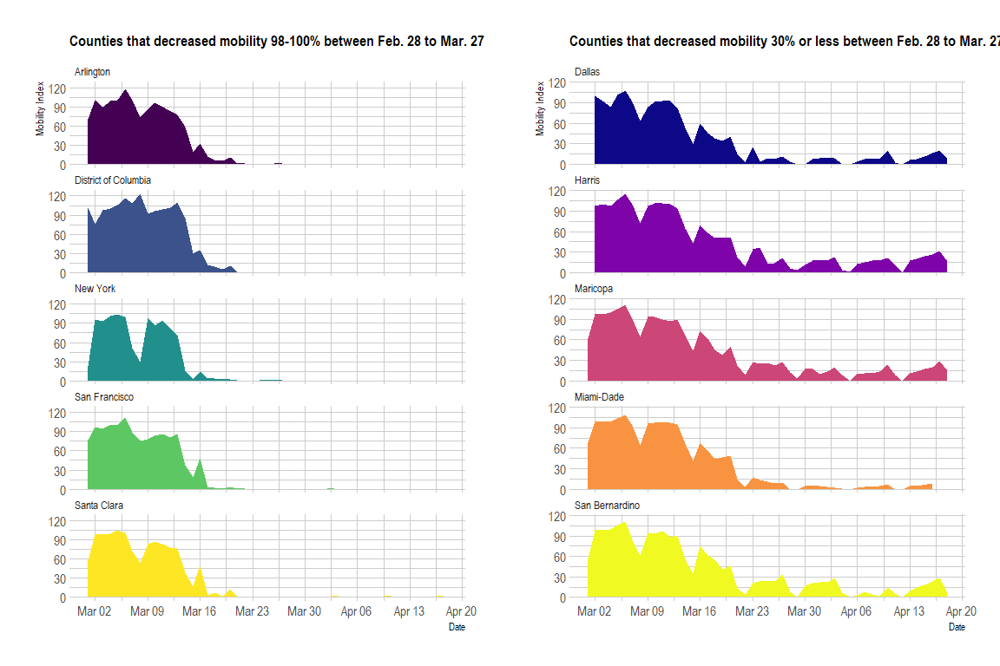
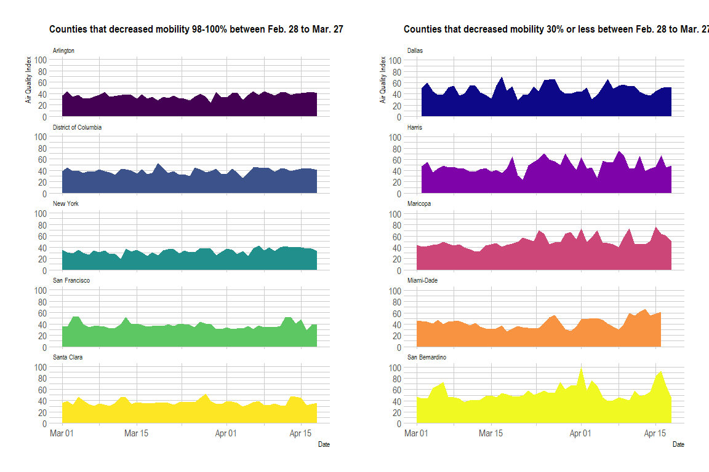

AQI vs Mobility Project: Data Analyses
================
Anjelica Martinez, Joanna Rashid, Yousif Alnuaimi
05/08/2020

-   [The Relationship Between Air Quality and Mobility of Individuals Following COVID-19 Related “Shelter-in-Place” Orders](#the-relationship-between-air-quality-and-mobility-of-individuals-following-covid-19-related-shelter-in-place-orders)
-   [Exploratory Data Analyses](#exploratory-data-analyses)
-   [Time Series Plots](#time-series-plots)
    -   [Mobility Over Time](#mobility-over-time)
    -   [Air Quality Over Time](#air-quality-over-time)
-   [Correlation Analyses](#correlation-analyses)
    -   [Scatterplot with Regression Line](#scatterplot-with-regression-line)
    -   [Pearson's Product Moment Correlation Coefficient](#pearsons-product-moment-correlation-coefficient)
-   [Interpretation of Correlation Analyses](#interpretation-of-correlation-analyses)
    -   [Double Y-Axis Plot Time Series of Mobility vs AQI for counties with significant p-values](#double-y-axis-plot-time-series-of-mobility-vs-aqi-for-counties-with-significant-p-values)
-   [Conclusion](#conclusion)
-   [Recommendations](#recommendations)

``` r
# Libraries
library(easypackages)
libraries("gridExtra", "viridis", "tidyverse", "plotly",
          "hrbrthemes", "htmlwidgets", "ggpubr", "scales")
```

The Relationship Between Air Quality and Mobility of Individuals Following COVID-19 Related “Shelter-in-Place” Orders
=====================================================================================================================

This notebook contains all the code we used to run our analyses. We used the following statistical tests and tools:

-   Pearson's Product Correlation Test
-   Scatterplot and regression line
-   Double-Y-Axis Plots showing mobility vs AQI

Exploratory Data Analyses
=========================

We used the finalized data prep `.Rdata` file that we created in the prior notebook. It contains all aqi and mobility values for the 10 counties of interest.

``` r
load("../Scripts/data/tidy/tidy_mobility_vs_aqi.RData")
```

**The three datasets we worked with are:**

-   `df`: AQI, mobility index, and pollutant values for the 10 counties of interest
-   `high_mobility`: counties that decreased mobility 98-100% between Feb. 28 to Mar. 27
-   `low_mobility`: counties decreased mobility 30% or less between Feb. 28 to Mar. 27

**Variables of Interest** \* `m50`: The median of the max-distance mobility for all samples in the specified region. \* `m50_index`: The percent of normal m50 in the region, with normal m50 defined during 2020-02-17 to 2020-03-07. \* `AQI`: Average air quality index for that day \* `Pollutant names (e.g. Ozone, PM25)`: average daily value \* `main_pollutant`: Represents which pollutant was the main pollutant contributing to AQI

``` r
head(df)
```

    ##         date               county   m50 m50_index aqi main_pollutant ozone pm25
    ## 1 2020-03-01            Arlington 3.270        71  37          Ozone    37    .
    ## 2 2020-03-01 District of Columbia 3.739       102  39          Ozone    39   26
    ## 3 2020-03-01             Maricopa 5.387        62  44          Ozone    44   43
    ## 4 2020-03-01           Miami-Dade 5.467        68  47          Ozone    47   30
    ## 5 2020-03-01             New York 0.462        23  35          Ozone    35    .
    ## 6 2020-03-01       San Bernardino 4.508        57  47          PM2.5    47   47
    ##     co  so2 pm10  no2
    ## 1 <NA> <NA> <NA> <NA>
    ## 2 <NA> <NA> <NA> <NA>
    ## 3    7    1   17   29
    ## 4 <NA> <NA> <NA> <NA>
    ## 5    2 <NA>    . <NA>
    ## 6 <NA> <NA> <NA> <NA>

``` r
head(high_mobility)
```

    ##         date               county   m50 m50_index aqi main_pollutant ozone pm25
    ## 1 2020-03-01            Arlington 3.270        71  37          Ozone    37    .
    ## 2 2020-03-01 District of Columbia 3.739       102  39          Ozone    39   26
    ## 5 2020-03-01             New York 0.462        23  35          Ozone    35    .
    ## 7 2020-03-01        San Francisco 2.663        77  36          Ozone    36   20
    ## 8 2020-03-01          Santa Clara 4.088        57  36          Ozone    36   29
    ## 9 2020-03-02            Arlington 4.594       100  44          Ozone    44    .
    ##     co  so2 pm10  no2
    ## 1 <NA> <NA> <NA> <NA>
    ## 2 <NA> <NA> <NA> <NA>
    ## 5    2 <NA>    . <NA>
    ## 7 <NA> <NA> <NA> <NA>
    ## 8 <NA> <NA> <NA> <NA>
    ## 9 <NA> <NA> <NA> <NA>

``` r
head(low_mobility)
```

    ##          date         county   m50 m50_index aqi main_pollutant ozone pm25   co
    ## 3  2020-03-01       Maricopa 5.387        62  44          Ozone    44   43    7
    ## 4  2020-03-01     Miami-Dade 5.467        68  47          Ozone    47   30 <NA>
    ## 6  2020-03-01 San Bernardino 4.508        57  47          PM2.5    47   47 <NA>
    ## 10 2020-03-02         Dallas 9.311       100  50          PM2.5    23   50 <NA>
    ## 12 2020-03-02         Harris 8.717        97  48          PM2.5    37   48 <NA>
    ## 13 2020-03-02       Maricopa 8.438        97  41          Ozone    41   26    5
    ##     so2 pm10  no2
    ## 3     1   17   29
    ## 4  <NA> <NA> <NA>
    ## 6  <NA> <NA> <NA>
    ## 10 <NA> <NA> <NA>
    ## 12 <NA> <NA> <NA>
    ## 13    1   19   24

Time Series Plots
=================

To get a quick visual overview, we two seperate time series plots: mobilty vs time, and aqi vs time.

Mobility Over Time
------------------

Here we plotted the mobility (`m50_index`) for each county from March 1st to April 18th, 2020. You can see how quickly mobility dropped for the counties that implemented shelter-in-place procedures promptly versus the counties that took longer.

``` r
# Counties that decreased mobility 98-100% between Feb. 28 to Mar. 27
high_mobility_plot <- ggplot(high_mobility, aes(x = date, y = m50_index, fill = county)) +
                       geom_area() +
                       scale_fill_viridis(discrete = TRUE) +
                       theme(legend.position = "none") +
                       labs(
                         title = "Counties that decreased mobility 98-100% between Feb. 28 to Mar. 27",
                         x = "Date",
                         y = "Mobility Index") +
                       scale_x_date(date_labels = "%b %d", date_breaks = "1 week") +
                       scale_y_continuous(breaks = seq(0, 200, by = 30)) +
                       theme_ipsum() +
                       theme(
                             legend.position = "none",
                             panel.spacing = unit(0, "lines"),
                             strip.text.x = element_text(size = 10),
                             plot.title = element_text(size = 13)) +
                       facet_wrap(county ~ ., ncol = 1)

# Counties that decreased mobility 30% or less between Feb. 28 to Mar. 27
low_mobility_plot <- ggplot(low_mobility, aes(x = date, y = m50_index, fill = county)) +
                       geom_area() +
                       scale_fill_viridis(discrete = TRUE, option = "plasma") +
                       theme(legend.position = "none") +
                       labs(title = "Counties that decreased mobility 30% or less between Feb. 28 to Mar. 27",
                            x = "Date",
                            y = "Mobility Index") +
                       scale_x_date(date_labels = "%b %d", date_breaks = "1 week") +
                       scale_y_continuous(breaks = seq(0, 200, by = 30)) +
                       theme_ipsum() +
                       theme(
                             legend.position = "none",
                             panel.spacing = unit(0, "lines"),
                             strip.text.x = element_text(size = 10),
                             plot.title = element_text(size = 13)) +
                       facet_wrap(county ~ ., ncol = 1)

# Show both plots side by side
grid.arrange(high_mobility_plot, low_mobility_plot, ncol = 2)
```



Air Quality Over Time
---------------------

Here we plotted the daily average air quality index (`aqi`) for each county from March 1st to April 18th, 2020.

``` r
# Counties that decreased mobility 98-100% between Feb. 28 to Mar. 27
high_mobility_aqi <- ggplot(high_mobility, aes(x = date, y = aqi, fill = county)) +
                       geom_area() +
                       scale_fill_viridis(discrete = TRUE) +
                       theme(legend.position = "none") +
                       labs(title = "Counties that decreased mobility 98-100% between Feb. 28 to Mar. 27",
                            x = "Date", 
                            y = "Air Quality Index") +
                       scale_x_date(date_labels = "%b %d") +
                       scale_y_continuous(limits = c(0, 100),
                                          breaks = seq(0, 100, by = 20)) +
                       theme_ipsum() +
                         theme(
                           legend.position = "none",
                           panel.spacing = unit(0, "lines"),
                           strip.text.x = element_text(size = 8),
                           plot.title = element_text(size = 13)) +
                       facet_wrap(county ~ ., ncol = 1)

# Counties that decreased mobility 30% or less between Feb. 28 to Mar. 27
low_mobility_aqi <- ggplot(low_mobility, aes(x = date, y = aqi, fill = county)) +
                     geom_area() +
                     scale_fill_viridis(discrete = TRUE, option = "plasma") +
                     theme(legend.position = "none") +
                     labs(title = "Counties that decreased mobility 30% or less between Feb. 28 to Mar. 27", 
                          x = "Date", 
                          y = "Air Quality Index") +
                     scale_x_date(date_labels = "%b %d") +
                     scale_y_continuous(breaks = seq(0, 100, by = 20)) +
                     theme_ipsum() +
                     theme(
                       legend.position = "none",
                       panel.spacing = unit(0, "lines"),
                       strip.text.x = element_text(size = 8),
                       plot.title = element_text(size = 13)) +
                     facet_wrap(county ~ ., ncol = 1)

# Show both plots side by side
grid.arrange(high_mobility_aqi, low_mobility_aqi, ncol = 2)
```



Correlation Analyses
====================

For correlation analysis, we decided to run both a correlation scatterplot with regression and a correlation test.

Scatterplot with Regression Line
--------------------------------

We used the `ggscatter` to get a visualization of the data for each county. A bonus to using this plot is that it includes the *r* and *p*-values for each county, too.

``` r
# Correlation scatterplot for all 10 counties
ggscatter(df, x = "aqi", 
          y = "m50_index", 
          color = "county",
          palette = c("#440154", "#0d0887", "#3b528b", "#7e03a8", "#cc4678", 
                      "#f89441", "#21908c", "#f0f921", "#5dc863", "#fde725"),
          add = "reg.line", 
          conf.int = TRUE, 
          cor.coef = TRUE,
          cor.method = "pearson",
          title = "Relationship Between Air Quality and Mobility",
          xlab = "Air Quality Index", 
          ylab = "Mobility Index",
          add.params = list(color = "red",
                            fill = "lightgray")) +
          facet_wrap(~county,
                     ncol = 5,
                     scales = "free") +
          theme(legend.position = "none")
```


Pearson's Product Moment Correlation Coefficient
------------------------------------------------

We also ran `corr.test()` to test for association between mobility and aqi per county using Peason's product moment correlation coefficient.

``` r
results = list() # Prep a list to store your corr.test results
counter = 0 # To store your corr.test into list through iterating

for (i in unique(df$county))
{
  counter = counter + 1
  # Creates x and y values for cor.test()
  x = as.numeric(df[df$county == i,]$aqi)
  y = as.numeric(df[df$county == i,]$m50_index)
  
  results[[i]] <- cor.test(x, y, method = "pearson") # correlation test
}
results
```

    ## $Arlington
    ## 
    ##  Pearson's product-moment correlation
    ## 
    ## data:  x and y
    ## t = -0.13923, df = 44, p-value = 0.8899
    ## alternative hypothesis: true correlation is not equal to 0
    ## 95 percent confidence interval:
    ##  -0.3093981  0.2709638
    ## sample estimates:
    ##         cor 
    ## -0.02098491 
    ## 
    ## 
    ## $`District of Columbia`
    ## 
    ##  Pearson's product-moment correlation
    ## 
    ## data:  x and y
    ## t = -0.14585, df = 47, p-value = 0.8847
    ## alternative hypothesis: true correlation is not equal to 0
    ## 95 percent confidence interval:
    ##  -0.3006673  0.2614916
    ## sample estimates:
    ##         cor 
    ## -0.02126894 
    ## 
    ## 
    ## $Maricopa
    ## 
    ##  Pearson's product-moment correlation
    ## 
    ## data:  x and y
    ## t = -4.4007, df = 47, p-value = 6.168e-05
    ## alternative hypothesis: true correlation is not equal to 0
    ## 95 percent confidence interval:
    ##  -0.7130733 -0.3053841
    ## sample estimates:
    ##        cor 
    ## -0.5401928 
    ## 
    ## 
    ## $`Miami-Dade`
    ## 
    ##  Pearson's product-moment correlation
    ## 
    ## data:  x and y
    ## t = -1.0901, df = 41, p-value = 0.282
    ## alternative hypothesis: true correlation is not equal to 0
    ## 95 percent confidence interval:
    ##  -0.4457046  0.1395513
    ## sample estimates:
    ##        cor 
    ## -0.1678268 
    ## 
    ## 
    ## $`New York`
    ## 
    ##  Pearson's product-moment correlation
    ## 
    ## data:  x and y
    ## t = -2.6541, df = 47, p-value = 0.01082
    ## alternative hypothesis: true correlation is not equal to 0
    ## 95 percent confidence interval:
    ##  -0.58304029 -0.08885961
    ## sample estimates:
    ##       cor 
    ## -0.361035 
    ## 
    ## 
    ## $`San Bernardino`
    ## 
    ##  Pearson's product-moment correlation
    ## 
    ## data:  x and y
    ## t = -1.3587, df = 47, p-value = 0.1807
    ## alternative hypothesis: true correlation is not equal to 0
    ## 95 percent confidence interval:
    ##  -0.45094540  0.09181615
    ## sample estimates:
    ##        cor 
    ## -0.1943995 
    ## 
    ## 
    ## $`San Francisco`
    ## 
    ##  Pearson's product-moment correlation
    ## 
    ## data:  x and y
    ## t = 1.2995, df = 47, p-value = 0.2001
    ## alternative hypothesis: true correlation is not equal to 0
    ## 95 percent confidence interval:
    ##  -0.1002044  0.4441751
    ## sample estimates:
    ##       cor 
    ## 0.1862399 
    ## 
    ## 
    ## $`Santa Clara`
    ## 
    ##  Pearson's product-moment correlation
    ## 
    ## data:  x and y
    ## t = 0.33716, df = 47, p-value = 0.7375
    ## alternative hypothesis: true correlation is not equal to 0
    ## 95 percent confidence interval:
    ##  -0.2353263  0.3258169
    ## sample estimates:
    ##        cor 
    ## 0.04912073 
    ## 
    ## 
    ## $Dallas
    ## 
    ##  Pearson's product-moment correlation
    ## 
    ## data:  x and y
    ## t = -0.21342, df = 46, p-value = 0.8319
    ## alternative hypothesis: true correlation is not equal to 0
    ## 95 percent confidence interval:
    ##  -0.3127904  0.2549623
    ## sample estimates:
    ##         cor 
    ## -0.03145086 
    ## 
    ## 
    ## $Harris
    ## 
    ##  Pearson's product-moment correlation
    ## 
    ## data:  x and y
    ## t = -2.513, df = 46, p-value = 0.01554
    ## alternative hypothesis: true correlation is not equal to 0
    ## 95 percent confidence interval:
    ##  -0.57482953 -0.07024184
    ## sample estimates:
    ##        cor 
    ## -0.3474422

Interpretation of Correlation Analyses
======================================

Based on these data the counties with significant results are Harris, weak negative correlation (*r* = -0.35, *p* = .016), Maricopa weak negative correlation(*r* = -0.54, *p* &lt; .001), and New York weak negative correlation (*r* = -.36, *p* = .011). However, each county The other counties results were no significant.

Double Y-Axis Plot Time Series of Mobility vs AQI for counties with significant p-values
----------------------------------------------------------------------------------------

We ploted a double Y-axis time series plot to see how mobility and aqi changed over time for the three counties with significant findings.

``` r
# Significant Counties dataframe
sig_counties_values <- filter(df, county %in% c("Harris", "Maricopa", "New York")) %>% select(date, county, aqi, m50_index)

# Color values
aqi_color <- "#69b3a2"
mobility_color <- rgb(0.2, 0.6, 0.9, 1)

# Significant Counties Double y-axis Plot
ggplot(sig_counties_values, aes(x = date)) +
  geom_line(aes(y = aqi), size = 1, color = aqi_color) + 
  geom_line(aes(y = m50_index), size = 1, color = mobility_color) +
  xlab("Date") +
  scale_y_continuous(
    name = "Air Quality Index",
    sec.axis = sec_axis(~ ., name = "Mobility Index")) + 
  facet_wrap(~county, ncol = 3) +
  theme_ipsum() +
  theme(
    axis.title.y = element_text(color = aqi_color, size = 13),
    axis.title.y.right = element_text(color = mobility_color, size = 13)) +
  ggtitle("Air Quality Increases as Mobility Decreases")
```

 Here are the three counties with significant correlations between mobility and aqi.

``` r
ggscatter(sig_counties_values, x = "aqi", y = "m50_index", color = "county",
          palette = c("#7e03a8", "#cc4678", "#21908c"),
          add = "reg.line", 
          conf.int = TRUE, 
          cor.coef = TRUE, 
          cor.method = "pearson",
          title = "Relationship Between Air Quality and Mobility",
          xlab = "Air Quality Index", 
          ylab = "Mobility Index",
          add.params = list(color = "red",
                            fill = "lightgray")) +
          facet_wrap(~county, ncol = 3, scales = "free_x") +
          theme(legend.position = "none")
```


Conclusion
==========

The COVID-19 crisis resulted in extensive "shelter-in-place" orders worldwide in order to reduce transmission of the virus. In the United States, shelter-in-place orders were left up to the states and governing local governments to decide when to shelter-in-place and for how long. Because of this, we have data from places where the shelter-in-place was declared earlier than others, which corresponding data of possible effects of this in relation to air quality and mobility.

Numerous news sources reported pollution decreases around the world, including [Los Angeles noticeable decrease in visual smog](https://www.businessinsider.com/photos-stay-at-home-order-reduced-los-angeles-notorious-smog-2020-4) and [Italy's crystal clear Venice canals](https://www.insider.com/satellite-images-venice-canals-clear-coronavirus-lockdown-2020-4). Much speculation surrounds the reason for the decrease in pollution and whether it is related to shelter-in-place orders.

We hypothesized that there would be a statistically significant relationship between air quality and mobility. Our results show that there is a weak negative correlation between mobility and air quality for Harris County (*r* = -0.35, *p* = .016), Maricopa County (*r* = -0.35, *p* = .016), and New York County (*r* = -0.35, *p* = .016) only. The remaining counties results were not significant and no conclusions can be made on the relationship between mobility and air quality.

Recommendations
===============

Because we focused on the 10 counties reported in the news article, we believe that future researchers should look into reviewing air quality levels, pollutant levels, and mobility information for all counties across the United States to get a clearer and possibly better picture of the relationship between mobility and pollution/air quality. An additional important aspect may be to observe the effects of industrial pollutant output levels and whether they had any influence on general air quality during the pandemic.
